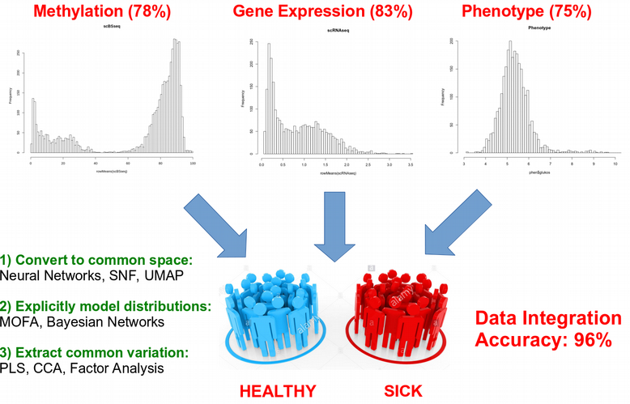

# IntegrativeOmicsWorkflow
Here we provide a primer-workflow for biological data integration analysis. The workflow was developed within the long-term bioinformatics support project, PI [Charlotte Ling](https://portal.research.lu.se/sv/persons/charlotte-ling), Lund University. 

**Authors**:
* Nikolay Oskolkov, bioinformatician at SciLifeLab, NBIS Long Term Support, nikolay.oskolkov@scilifelab.se
* Tina Rönn, associate researcher at Lund University Diabetes Center (LUDC), tina.ronn@med.lu.se
* Alexander Perfilyev, bioinformatician at Lund University Diabetes Center (LUDC), alexander.perfilyev@med.lu.se
* Charlotte Ling, professor at Lund University Diabetes Center (LUDC), charlotte.ling@med.lu.se

# Background
Integrating multiple layers of biomedical information (multiOmics data) potentially allows for more accurate modeling and deeper understanding of complex human diseases such as type 2 diabetes (T2D). Here, we utilized a Machine Learning approach to perform an integrative multiOmics analysis of DNA methylation, gene expression, genetic variation and phenotypic information in human pancreatic islets from 110 individuals, with ~30% being T2D cases. We demonstrate that supervised linear OmicOmics integration via DIABLO algorithm based on Partial Least Squares (PLS) achieves a high accuracy of 91±15% of T2D prediction with the area under the ROC curve 0.96±0.08 on the test data set after a thorough cross-validation.

# Idea of data integration
